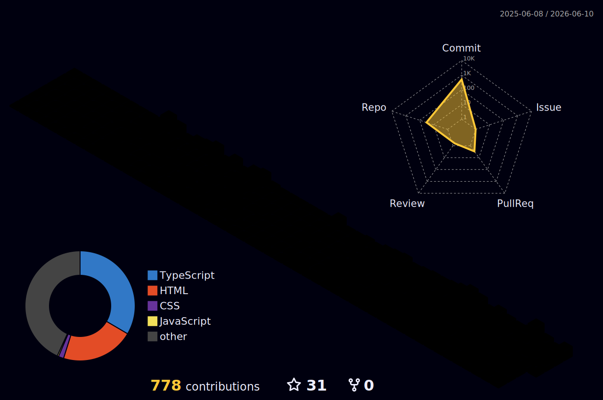

<div align="center">
  
  
  
</div>

<h1 align="center">👋 Hey, I'm <strong>Prosonjit</strong></h1>
<h3 align="center">~ HTML Frontend Developer</h3>

<div align="start">

[](https://git.io/typing-svg)

</div>

---

## 💼 Tech Stack

```text
Languages     : C, HTML, CSS, JavaScript, TypeScript
Frameworks    : Bootstrap, jQuery
Tools         : Git, GitHub & VS-Code
Operating Sys : Windows
```

---

<br><br>

<div align="center">  </div>

 <br>

<div align="center">  <h2>💼 Let's Connect </h2> </div>
<div align="center">
  <a href="prosonjitdatta2006@gmail.com">
    
  </a>
  <a href="https://www.linkedin.com/in/prosonjit2006/" target="_blank">
    
  </a>
   <a href="#" target="_blank">
    
  </a>
  <!-- <a href="#" target="_blank">
     
  </a> -->
    <!-- sqlite, safari, google-chrome are other good icon options -->
</div>

  <a href="https://github.com/prosonjit2006">
    
  </a>

## 📈 Contribution Graph

<p align="center">
  
</p>

<details open>
  <summary><h2>🟡 Pacman Contribution Graph</h2></summary>

  <br>

<div align="center">
  <picture>
    <source media="(prefers-color-scheme: dark)" srcset="https://raw.githubusercontent.com/prosonjit2006/prosonjit2006/output/pacman-contribution-graph-dark.svg" />
    <source media="(prefers-color-scheme: light)" srcset="https://raw.githubusercontent.com/prosonjit2006/prosonjit2006/output/pacman-contribution-graph.svg" />
    
  </picture>
  <br/>
  <sub><i>Auto-updated every 12 hours via GitHub Actions.</i></sub>
</div>
</details>

## 🐍 Contribution Graph

<div align="center">
    
</div>

---

<p align="center">  </p>

